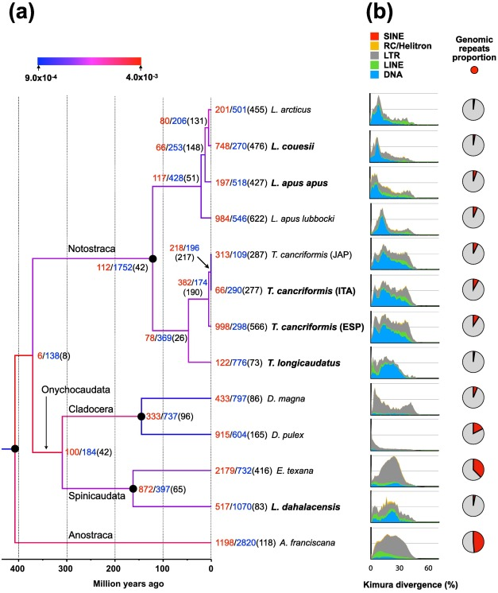

#### Abstract: 
This analysis presents five genome assemblies of four Notostraca taxa. Notostraca origin dates to the Permian/Upper Devonian and the extant forms show a striking morphological similarity to fossil taxa. The comparison of sequenced genomes with other Branchiopoda genomes shows that, despite the morphological stasis, Notostraca share a dynamic genome evolution with high turnover for gene families' expansion/contraction and a transposable elements content comparable to other branchiopods. While Notostraca substitutions rate appears similar or lower in comparison to other branchiopods, a subset of genes shows a faster evolutionary pace, highlighting the difficulty of generalizing about genomic stasis versus dynamism. Moreover, we found that the variation of Triops cancriformis transposable elements content appeared linked to reproductive strategies, in line with theoretical expectations. Overall, besides providing new genomic resources for the study of these organisms, which appear relevant for their ecology and evolution, we also confirmed the decoupling of morphological and molecular evolution.

  

  

Now published in Genomics|  
Luchetti, A., Forni, G., Martelossi, J., Savojardo, C., Martelli, P.L., Casadio, R., Skaist, A.M., Wheelan, S.J., Mantovani, B., 2021. Comparative genomics of tadpole shrimps (Crustacea, Branchiopoda, Notostraca): Dynamic genome evolution against the backdrop of morphological stasis. Genomics 113, 4163–4172. https://doi.org/10.1016/j.ygeno.2021.11.001
