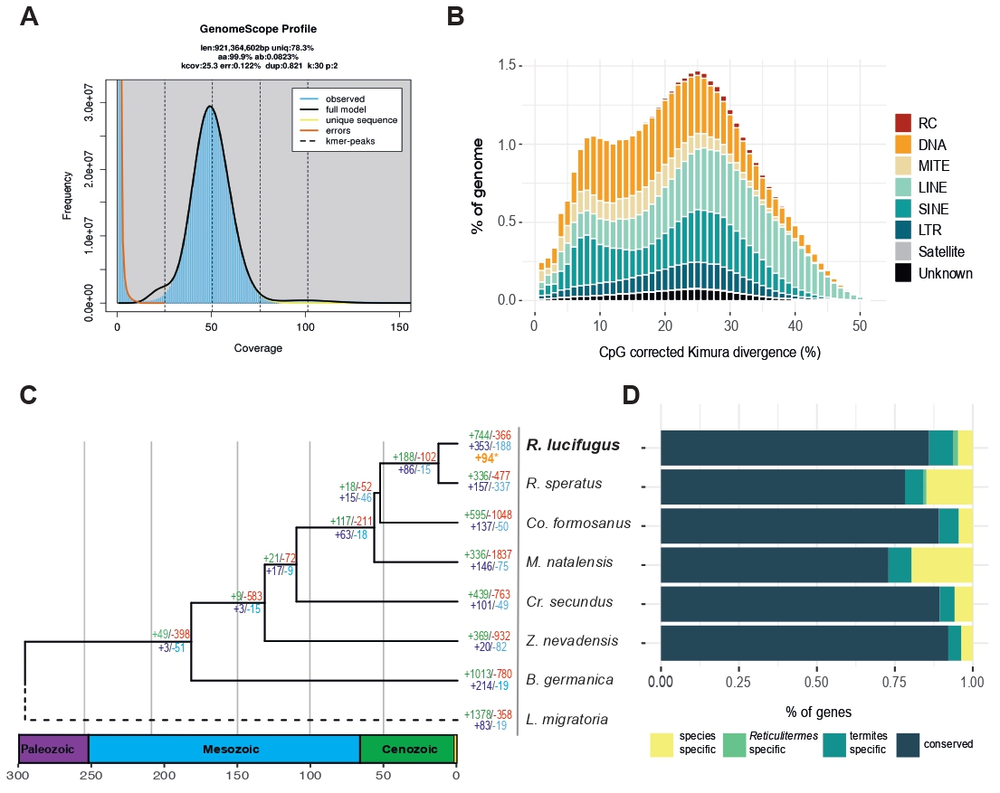

#### Abstract: 
Termites (Insecta, Blattodea, Termitoidae) are a widespread and diverse group of eusocial insects known for their ability to digest wood matter. Here we report the draft genome of the subterranean termite Reticulitermes lucifugus, an economically important species in the Holarctic region and among the most studied taxa with respect to the eusocial organization. The final assembly (~813 Mb) covered up the 88% of the expected genome size and, coherently with the Asexual Queen Succession mating system, was found in almost complete homozygosity. We predicted 16,349 highly supported gene models and a repetitive content of 42%. Transposable elements show similar evolutionary dynamics compared to other termites, with two main peaks of activity localized at 25% and 8% of Kimura divergence driven by DNA, LINE and SINE elements. Gene families turnover analyses identified multiple instances of gene duplications associated with the R. lucifugus diversification, with significant lineage-specific gene families expansions related to development, perception and nutrient metabolism pathways. Finally, we analyzed P450 and odorant receptor genes repertoires in more detail, highlighting a large diversity and a dynamic evolutionary history of these proteins also among analyzed termite genomes. This newly assembled genome will provide a valuable resource for further understanding the molecular basis of termites  

  

Under minor revision in Insect Molecular Biology. Reference soon!

