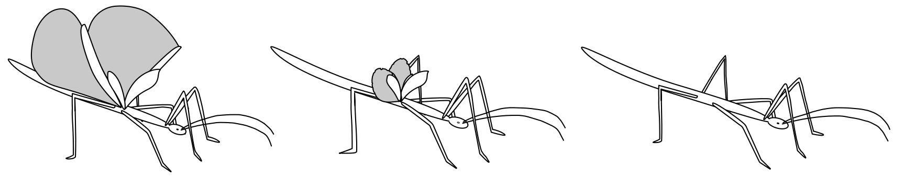

  

# Short Bio

 

### The Past

I was raised in Gradisca d'Isonzo, a small town near Trieste, where I was born in 1993. After High School, in 2012, I've worked for a year and then I decided to move in Bologna where I got my Bachelor of Science in 2017.  

In march 2020 I got my Master degree in "Biodiversity and Evolution", *cum laude*, with a dissertation entitled: **Molecular Phylogenetics, Divergence time and Evolution of Phasmida (Insecta)**, supervised by professor **[Andrea Luchetti](https://www.unibo.it/sitoweb/andrea.luchetti/)**. The thesis was the result of one year of intership at the **[MoZoo Lab](http://www.mozoolab.unibo.it/)**, where I was involved phylogentic and macroevolutionary analyses, focused on the evolution of wings in Phasmatodea (Insecta) ([more info](.\wings_evolution.html)).
  

***
 

### The present and the near future

Starting from November 2020 I am a Ph.D student working on molluscs and bivalves evolution in a comparative genomic approach, supervised by professor **[Fabrizio Ghiselli](https://www.unibo.it/sitoweb/fabrizio.ghiselli/)** at the **[MoZoo Lab](http://www.mozoolab.unibo.it/)**. My main focus are  Transposable elements (TEs) and their evolutionary dynamics.

Moreover, I am involved in comparative genomics studies of **Notostraca** and the termite *Reticulitermes lucifugus* 

***
  
